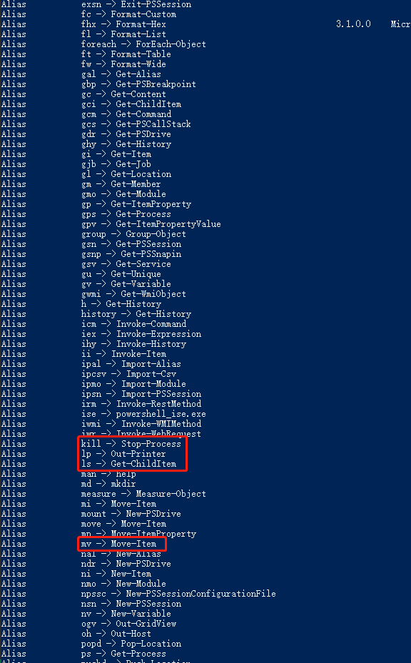
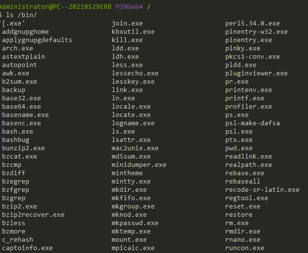

# 如何舒适的在windows上开发

## 前言
之前使用 `macOS` 进行工作开发，突然间切换到 `win` 真的非常不习惯。主要不习惯的地方有：
- `win10` 命令行不天然支持 `linux` 命令，这让用惯了 `linux` 的我非常头疼。
- 想安装一些 cli 主题 丰富一下命令行界面，提升开发体验

接下来是我在 `win10` 上配置开发环境的心路历程。

## 目录

- 1、初探 `win10` 开发环境
- 2、类 `linux` 命令行
- 3、直接在windows上运行 `linux` 环境

## 1、初探 win10 开发环境
对我个人而言，开发时有两个东西是必不可少的：`ide`和`terminal`。作为一个前端开发，`ide`我只用[vscode](https://code.visualstudio.com/)，`vscode` YYDS！
至于命令行工具，之前在macOS上使用 `iTerm2 + zsh`，但是 `win10` 上我还不知道怎么搭配命令行工具最舒适，接下来仔细分辨一下。
### cmd.exe
`win` 系统自带的命令行程序，通过 `help` 命令，我们可以看到他的使用方式和 `linux` 命令有很大的区别，使用难度非常的大，当然是第一个被pass的选项。

### PowerShell.exe
基于 `.NET` 开发的命令行工具，可以在 微软商城 中下载。比 `cmd.exe` 高的一点在于，它可以在 `win` 系统上运行 `linux` 命令，比如 `ls`。

但是实际上，`PowerShell.exe` 就是一个套壳 `cmd.exe`，他的运行时环境其实和 `cmd.exe` 一模一样，只是对于常用的 `linux` 命令集做了一个别名的转换，我们可以通过 `ALIAS` 来查看别名：

上述两个命令行工具均无法满足我的要求，于是我就在想，如何可以在 `win10` 上起一个类似 `linux` 系统，并且能访问我的本地文件就好了，朝着这个方向我开始了下一步的探索。

## 2、类 linux 命令行
网上搜了搜  `win10` 上好用的 `terminal`，我了解到，基于 `unix` 的命令行工具多半要收费，不收费的多少功能受到掣肘，要么不支持多会话，要么就是和本地文件IO非常的慢。

### ConEmu.exe
这是一款开源的命令行工具，他可以执行 类 `unix shell` 命令，功能也比较强大，内置的 `startup task` 可以选择你想要的运行的 `bash` 环境，也可以自定义运行的环境，只需要通过配置`task`即可。

他是内置了一些 不同 `unix` 的 `可执行程序`，在启动的时候执行不同的 `可执行程序` 达到 在 `win` 上模拟 `unix` 的效果，通过他的命令行我们可以看到内部执行的是 `*.exe` 文件 而非真正的 `shell` 命令文件：

### docker
当然我们可以起一个带 `node` 的docker镜像，然后把本地文件挂载到镜像中辅助开发，但是需要注意几个点：
- docker 镜像的端口的映射需要提前设置好，要增加暴露端口就需要重新启用一个docker镜像
- docker镜像中安装的一些依赖在docker容器删除的时候不会保留，除非把依赖全部打到镜像中，否则下次还需要手动添加依赖

> 但是从一定程度上也是有好处的，一份开发容器走天下。

## 3、直接在windows上运行 linux 环境
最后也算是找到了在 win 上运行 linux 的解决方案： `wsl`。这和虚拟机不一样，可以直接在 win 上起 linux 系统，可以做到真正的 linux 开发环境。

### 步骤
1. 首先需要在你的机子上安装 wsl
2. 在微软商城中下载 Ubuntu并安装，顺手设置Ubuntu为默认的wsl系统（此处可以按照 `资料参考` 中的文章进行）
3. 在 `vscode` 中下载安装 `Remote-WSL` 拓展程序，然后在 wsl 的Ubuntu环境中打开你的项目。

大功告成，你现在已经获得了一个win上的linux开发环境！

> 推荐把项目直接迁移到 `Ubuntu` 中，不然有可能会有 无法热更新 等等问题产生

### 参考资料
- [Top 15 Terminal Emulator for Windows](https://www.puttygen.com/windows-terminal-emulators)
- [ConEmu](https://conemu.github.io/)
- [What is wsl](https://docs.microsoft.com/en-us/windows/wsl/about)
- [在Windows中利用ConEmu无缝使用Ubuntu+zsh](https://blog.yuki-nagato.com/zh-cn/articles/wsl-conemu/)
- [HRM not work in wsl](https://github.com/microsoft/WSL/issues/4417#issuecomment-538516753)
